<div align="center">

# 🎬 Mentora - Decentralized Education Platform


> *A revolutionary education platform.*

[](https://opensource.org/licenses/MIT)

[View Demo](https://blockbinge.vercel.app/) | [Smart Contracts](https://github.com/AbhigyaKrishna/block-binge-contracts) | [Frontend Code](https://github.com/vaibhavkothari33/BlockBinge)

</div>

A decentralized education platform built with React, Web3, and Ethereum smart contracts. This platform allows users to stream content while paying through cryptocurrency, featuring a pay-as-you-watch model.


## 🌟 Features

- **Web3 Integration**: Seamless connection with MetaMask wallet
- **Pay-per-minute Streaming**: Users pay only for the content they watch
- **Real-time Billing**: Automatic billing based on watch time
- **Content Management**: Browse, search, and manage video content
- **User Authentication**: Secure login with Web3 capabilities
- **Responsive Design**: Works on desktop and mobile devices
- **AI Chatbot**: Interactive support for users
- **Dynamic Pricing**: Smart contracts adjust video prices based on demand
- **Access Control via NFTs**: Exclusive content access for NFT holders
- **Decentralized Storage**: Videos are stored on IPFS for censorship resistance


## 🏗️ Architecture

```mermaid
flowchart TB
    %% Start and Problem
    A[🏁 Hackaccino] --> B[🌐 Problem Statement]
    B --> B1[❗ High entry barrier in Web3]
    B --> B2[❗ Unverified learning paths]
    B --> B3[❗ No skill verification]
    B --> B4[❗ Lack of personalization]

    %% Solution
    B --> C[💡 Our Solution: Mentora Platform]

    %% Core Features
    C --> D1[🤖 AI Assignment reviewer]
    C --> D2[🔗 Blockchain Features]
    C --> D3[📚 Learning Platform]
    C --> D4[🤖 Github Integration]
    C --> D5[🤖 IPFS Services]

    %% AI Integration Expanded
    D1 --> E1[🧠 Smart Learning Assistant]
    D1 --> E2[📊 Personalized Learning Paths]
    E2 --> E2a[📈 Adaptive content]
    D1 --> E3[🧪 Code Analysis]
    E3 --> E3a[⚠ Instant Feedback]

    %% Blockchain Features Expanded
    D2 --> F1[👛 Wallet Integration]
    F1 --> F1a[🔐 Secure login]
    D2 --> F2[⚙ Smart Contract Interaction]
    D2 --> F3[🪪 Certificate Verification]
    F3 --> F3a[🎓 Verifiable Credentials]

    %% Learning Platform Expanded
    D3 --> G1[🎓 Interactive Courses]
    G1 --> G1a[📹 Video lessons]
    D3 --> G2[📈 Progress Tracking]
    G2 --> G2a[📊 Learning analytics]
    D3 --> G3[👥 Community Features]
    G3 --> G3a[💬 Discussions & Forums]

    %% Architecture
    C --> H[🛠 Tech Stack]
    H --> H1[💻 Frontend: React, Vite, Tailwind]
    H --> H2[🧠 AI: Claude API, Custom Tools]
    H --> H3[🔗 Blockchain: Ethereum, IPFS, NFTs]

    %% Platform Pages
    C --> I[📄 Platform Pages]
    I --> I1[🏠 Homepage: Hero, Stats, Testimonials]
    I --> I2[📋 Dashboard: Progress, Courses]
    I --> I3[🎥 Course Interface: Assignments, Player]
    I --> I4[🙋 Profile Page: NFTs, Stats]

    %% Design System
    C --> J[🎨 Design System]
    J --> J1[🎨 Colors: Blue, Purple, Pink]
    J --> J2[🔤 Fonts: Inter, Consolas]
    J --> J3[🌙 Dark Mode Support]

    %% Security
    C --> K[🔒 Security Features]
    K --> K1[🔐 Wallet Login]
    K --> K2[🛡 Smart Contract Security]
    K --> K3[📁 IPFS Storage]
    K --> K4[🧾 Protected Routes]

    %% Roadmap
    C --> L[🚀 Roadmap]
    L --> L1[📱 Mobile App]
    L --> L2[🧠 AI Upgrades]
    L --> L3[💬 Community Forums]
    L --> L4[👨‍🏫 Live Tutoring]
    L --> L5[📚 More Courses]
    L --> L6[📊 Advanced Analytics]

    %% Styling for clarity
    style C fill:#8B5CF6,stroke:#4C1D95,color:#fff
    style D1 fill:#F97316,color:#fff
    style D2 fill:#10B981,color:#fff
    style D3 fill:#3B82F6,color:#fff
    style H fill:#6366F1,color:#fff
    style K fill:#EF4444,color:#fff
    style J fill:#EC4899,color:#fff
    style L fill:#22D3EE,color:#000
    style M fill:#84CC16,color:#000
    style N fill:#F59E0B,color:#000
```


## 🛠 Tech Stack

- **Frontend**: React.js with Vite
- **Styling**: Tailwind CSS
- **Blockchain**: Solidity Smart Contracts
- **Web3**: ethers.js, Web3-Storage, IPFS
- **Authentication**: Metamask Wallet Connection

## 👋 Prerequisites

Before you begin, ensure you have the following installed:
- Node.js (v14.0.0 or later)
- npm or yarn
- MetaMask browser extension
- Git

## 🚀 Getting Started

1. **Clone the repository**
```bash
git clone https://github.com/vaibhavkothari33/Mentora.git
cd Mentora
```

2. **Install dependencies**
```bash
npm install
# or
yarn install
```

3. **Set up environment variables**
Create a `.env` file in the root directory:
```env
VITE_CONTRACT_ADDRESS=your_contract_address
VITE_INFURA_ID=your_infura_id
VITE_CHAIN_ID=your_chain_id
```

4. **Start the development server**
```bash
npm run dev
```

5. **Build for production**
```bash
npm run build
```

## 🏛 Project Structure

```
Directory structure:
└── vaibhavkothari33-mentora/
    ├── README.md
    ├── eslint.config.js
    ├── index.html
    ├── LICENSE
    ├── package.json
    ├── postcss.config.js
    ├── tailwind.config.js
    ├── vercel.json
    ├── vite.config.js
    ├── public/
    └── src/
        ├── App.css
        ├── App.jsx
        ├── index.css
        ├── main.jsx
        ├── artifacts/
        │   └── contracts/
        │       └── EduChain.sol/
        │           └── EduChain.json
        ├── assets/
        ├── components/
        │   ├── Footer.jsx
        │   ├── Layout.jsx
        │   ├── Navbar.jsx
        │   ├── WalletConnect.jsx
        │   ├── edges/
        │   │   └── AnimatedEdge.jsx
        │   ├── nodes/
        │   │   ├── RoadmapMiniMap.jsx
        │   │   ├── RoadmapNode.jsx
        │   │   └── StepNode.jsx
        │   └── roadmap/
        │       └── ProgressIndicator.jsx
        ├── config/
        │   ├── contract.js
        │   └── gemini.js
        ├── context/
        │   └── ThemeContext.jsx
        ├── contracts/
        │   ├── CertificateNFT.sol
        │   ├── EduChain.json
        │   └── EduChain.sol
        ├── data/
        │   ├── aiAssignmentsData.js
        │   └── assignments.js
        ├── hooks/
        │   ├── useAgent.js
        │   └── useMentoraContract.js
        ├── pages/
        │   ├── About.jsx
        │   ├── AIAssignment.jsx
        │   ├── Assignments.jsx
        │   ├── Aurora.jsx
        │   ├── Contact.jsx
        │   ├── CourseDetails.jsx
        │   ├── Courses.jsx
        │   ├── CreateCourse.jsx
        │   ├── Dashboard.jsx
        │   ├── FAQ.jsx
        │   ├── Home.jsx
        │   ├── NotFound.jsx
        │   ├── Profile.jsx
        │   ├── RoadmapGenerator.jsx
        │   ├── SpotlightCard.jsx
        │   └── api/
        │       └── auth/
        │           └── github.js
        ├── styles/
        │   └── roadmap.css
        └── utils/
            ├── geminiAI.js
            ├── ipfsStorage.js
            ├── Mentora.json
            ├── mentoraBlockchain.js
            ├── storage.js
            ├── validation.js
            └── web3storage.js


```

## 🔒 Smart Contracts

The platform uses the following main smart contracts:
- `StreamingPlatform.sol`: Handles video streaming and payments
- `NFTMarketplace.sol`: Manages NFT trading functionality


### Contract Deployment

1. Install Hardhat and dependencies
```bash
npm i
npm run scripts/deploy.js
```

2. Deploy contracts
```bash
npx hardhat run scripts/deploy.js
npx hardhat node
```

## 🎮 Usage

1. Connect your MetaMask wallet
2. Browse available courses
3. Create courses of you own
4. GitHub integration
5. Use AI Roadmap generator to generate roadmaps

## 👥 Team

- Vaibhav Kothari - Full Stack Developer
- Abhigya Krishna - Blockchain Developer
- Navya Rathore - AI Developer
- Shreya Tripathi - qwerty
- Ashika Shrivastava - qwerty

## 🙏 Acknowledgments

- Langflow for AI 


