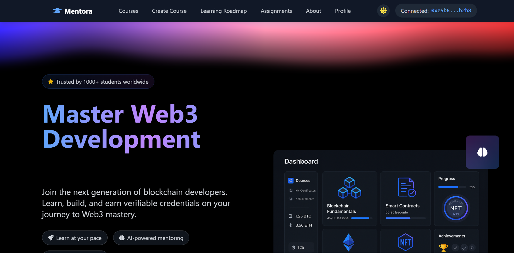
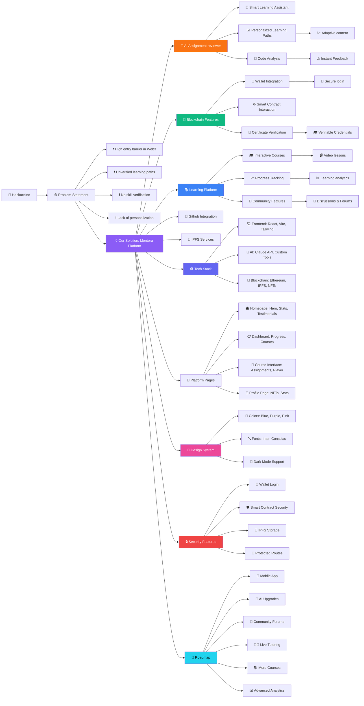

<div align="center">

# Mentora - AI-Powered Web3 Learning Platform 🚀


[](https://opensource.org/licenses/MIT)

[View Demo](https://mentora-rho.vercel.app/) | [Smart Contracts](https://github.com/AbhigyaKrishna/mentora-contracts) | [Frontend Code](https://github.com/vaibhavkothari33/Mentora)

</div>

## 🏆 Hackaccino Hackathon Project

Mentora is an innovative Web3 education platform that combines blockchain technology with AI-powered learning assistance to create a next-generation learning experience. Built during Hackaccino 2025, our platform aims to revolutionize how people learn and interact with Web3 technologies.

## 🌟 Problem Statement

The Web3 space faces several challenges in education:
- High barrier to entry for newcomers
- Lack of structured, verified learning paths
- Difficulty in verifying skills and credentials
- Limited personalized learning assistance

## 💡 Our Solution

Mentora addresses these challenges by providing:
1. AI-powered personalized learning assistance
2. Blockchain-verified NFT certificates
3. Interactive course content with real-time feedback
4. Community-driven learning environment

## ⚡ Key Features

### 🤖 AI Integration
- **Smart Learning Assistant**: Get real-time help with coding problems
- **Personalized Learning Paths**: AI-curated content based on your progress
- **Code Analysis**: Instant feedback on your assignments

### 🔗 Blockchain Features

- **Wallet Integration**: Seamless Web3 wallet connection
- **Smart Contract Interaction**: Real-world blockchain experience

### 📚 Learning Platform
- **Interactive Courses**: Hands-on learning experience
- **Progress Tracking**: Detailed analytics of your journey
- **Community Features**: Learn and grow together

## 🛠️ Technology Stack

### Frontend
- React + Vite
- TailwindCSS
- Framer Motion
- Ethers.js

### AI Integration
- Claude AI API
- Custom AI Components

### Blockchain
- Ethereum Smart Contracts
- IPFS Storage
- NFT Implementation


## 📸 Screenshots


*AI-Powered Dashboard*

## 🏗️ Architecture


## 🎯 Key Features Breakdown

### 1. Homepage
- Hero section with animated elements
- Featured courses showcase
- Platform statistics
- Learning process explanation
- Student testimonials

### 2. Dashboard
- Course progress tracking
- Active course display
- Achievement statistics
- Recent activity feed
- Performance metrics

### 3. Course Interface
- Video player with controls
- Course content organization
- Progress indicators
- Interactive assignments
- Certificate generation

### 4. Profile System
- User achievements
- Course history
- NFT certificate showcase
- Learning statistics
- Activity timeline

## 🔒 Security Features

- Secure wallet integration
- Protected routes
- Data encryption
- Smart contract security
- IPFS content storage

## 🎨 Design System

### Colors
- Primary: Blue (#3B82F6)
- Secondary: Purple (#8B5CF6)
- Accent: Pink (#EC4899)
- Background: Custom gradients
- Dark mode support

### Typography
- Headings: Inter
- Body: System font stack
- Monospace: Consolas

## 🤝 Contributing

1. Fork the repository
2. Create your feature branch (`git checkout -b feature/AmazingFeature`)
3. Commit your changes (`git commit -m 'Add some AmazingFeature'`)
4. Push to the branch (`git push origin feature/AmazingFeature`)
5. Open a Pull Request


## 🚀 Getting Started

1. **Clone the repository**
```bash
git clone https://github.com/vaibhavkothari33/Mentora.git
cd Mentora
```

2. **Install dependencies**
```bash
npm install
```

3. **Set up environment variables**
Create a `.env` file in the root directory:
```env
VITE_GEMINI_API_KEY=gemini_api_key
VITE_CONTRACT_ADDRESS=your_contract_address
VITE_INFURA_API_KEY=infura_api_key
VITE_INFURA_API_SECRET=infura_api_secret
VITE_API_URL=api_url
VITE_IPFS_SERVER=your_ipfs_server
VITE_GITHUB_CLIENT_ID=client_id
VITE_GITHUB_CLIENT_SECRET=client_secret
VITE_GITHUB_REDIRECT_URI=github_redirect_url
```

4. **Start the development server**
```bash
npm run dev
```

5. **Build for production**
```bash
npm run build
```

## 🏛 Project Structure

```
Directory structure:
└── vaibhavkothari33-mentora/
    ├── README.md
    ├── eslint.config.js
    ├── index.html
    ├── LICENSE
    ├── package.json
    ├── postcss.config.js
    ├── tailwind.config.js
    ├── vercel.json
    ├── vite.config.js
    ├── public/
    └── src/
        ├── App.css
        ├── App.jsx
        ├── index.css
        ├── main.jsx
        ├── artifacts/
        │   └── contracts/
        │       └── EduChain.sol/
        │           └── EduChain.json
        ├── assets/
        ├── components/
        │   ├── Footer.jsx
        │   ├── Layout.jsx
        │   ├── Navbar.jsx
        │   ├── WalletConnect.jsx
        │   ├── edges/
        │   │   └── AnimatedEdge.jsx
        │   ├── nodes/
        │   │   ├── RoadmapMiniMap.jsx
        │   │   ├── RoadmapNode.jsx
        │   │   └── StepNode.jsx
        │   └── roadmap/
        │       └── ProgressIndicator.jsx
        ├── config/
        │   ├── contract.js
        │   └── gemini.js
        ├── context/
        │   └── ThemeContext.jsx
        ├── contracts/
        │   ├── CertificateNFT.sol
        │   ├── EduChain.json
        │   └── EduChain.sol
        ├── data/
        │   ├── aiAssignmentsData.js
        │   └── assignments.js
        ├── hooks/
        │   ├── useAgent.js
        │   └── useMentoraContract.js
        ├── pages/
        │   ├── About.jsx
        │   ├── AIAssignment.jsx
        │   ├── Assignments.jsx
        │   ├── Aurora.jsx
        │   ├── Contact.jsx
        │   ├── CourseDetails.jsx
        │   ├── Courses.jsx
        │   ├── CreateCourse.jsx
        │   ├── Dashboard.jsx
        │   ├── FAQ.jsx
        │   ├── Home.jsx
        │   ├── NotFound.jsx
        │   ├── Profile.jsx
        │   ├── RoadmapGenerator.jsx
        │   ├── SpotlightCard.jsx
        │   └── api/
        │       └── auth/
        │           └── github.js
        ├── styles/
        │   └── roadmap.css
        └── utils/
            ├── geminiAI.js
            ├── ipfsStorage.js
            ├── Mentora.json
            ├── mentoraBlockchain.js
            ├── storage.js
            ├── validation.js
            └── web3storage.js


```

## 🔒 Smart Contracts

The platform uses the following main smart contracts:
- `Mentora.sol`: Handles the buying and selling of courses
- `AssignmentManager.sol`: Manages assignment data


### Contract Deployment

1. Install Hardhat and dependencies
```bash
npm i
npm run scripts/deploy.js
```

2. Deploy contracts
```bash
npx hardhat run scripts/deploy.js
npx hardhat node
```


## 👥 Team

- Vaibhav Kothari - Full Stack Developer
- Abhigya Krishna - Blockchain Developer
- Navya Rathore - AI Developer
- Shreya Tripathi - Frontend Developer
- Ashika Shrivastava - Extras

## 🙏 Acknowledgments

- [Framer Motion](https://www.framer.com/motion/) for animations
- [TailwindCSS](https://tailwindcss.com/) for styling
- [React Icons](https://react-icons.github.io/react-icons/) for icons
- [Ethers.js](https://docs.ethers.io/) for Web3 integration

## 📞 Contact

- Website: [mentora.com](https://mentora.com)
- Email: support@mentora.com
- Twitter: [@mentora](https://twitter.com/mentora)
- Discord: [Mentora Community](https://discord.gg/mentora)

## 🚀 Roadmap

🔸 Mobile app development

🔸Advanced AI features

🔸Community forums

🔸Live tutoring sessions

🔸Expanded course categories

🔸Enhanced analytics
